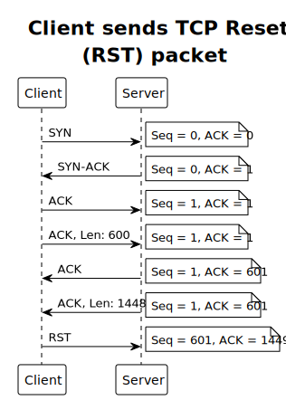

# TCP Butcher

A [tcpkill](https://en.wikipedia.org/wiki/Tcpkill) clone in Go with IPv6 support.

Still in development.

`libpcap` is needed for the `gopacket` libary.

## Usage

The [Berkeley Packet Filter syntax](https://www.ibm.com/docs/en/qsip/7.4?topic=queries-berkeley-packet-filters) can be build with cli args or options.  
When the interface cannot be found through the ip of `--host`, `--src` or `--dst`
then a `-i` or `--interface` option must be passed.


Butchering a outgoing ssh connection to 192.168.2.10 on port 22 on interface eno1

```bash
# BPF syntax
sudo tcpbutcher -i eno1 host host.domain.com and src port 22
# cli options
sudo tcpbutcher -i eno1 --host host.domain.com --src-port 22
```

Butchering a outgoing ssh connection to 2a02:8188:1640:1af0:dea6:32ff:fe50:5b1a on port 22 on interface eno1

```bash
# BPF syntax
sudo tcpbutcher -i eno1 host 2a02:8188:1640:1af0:dea6:32ff:fe50:5b1a and src port 22
# cli options
sudo tcpbutcher -i eno1 --host 2a02:8188:1640:1af0:dea6:32ff:fe50:5b1a --src-port 22
```

Butcher ssh connections on interface eno1

```bash
sudo tcpbutcher -i eno1 --src-port 22
```

### Help
Display help and all options

```bash
tcpbutcher --help
```

## How it works


